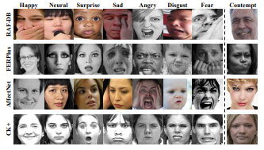
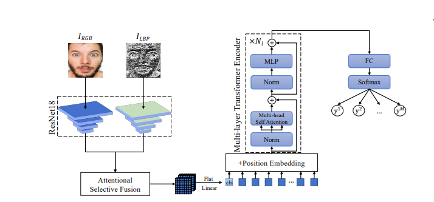
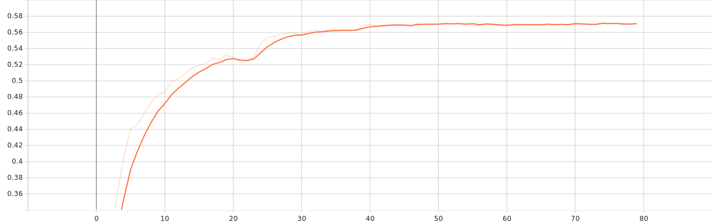
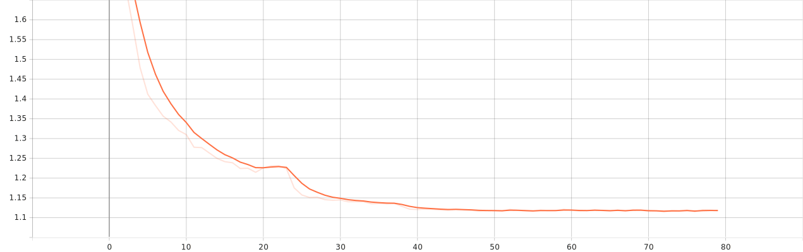
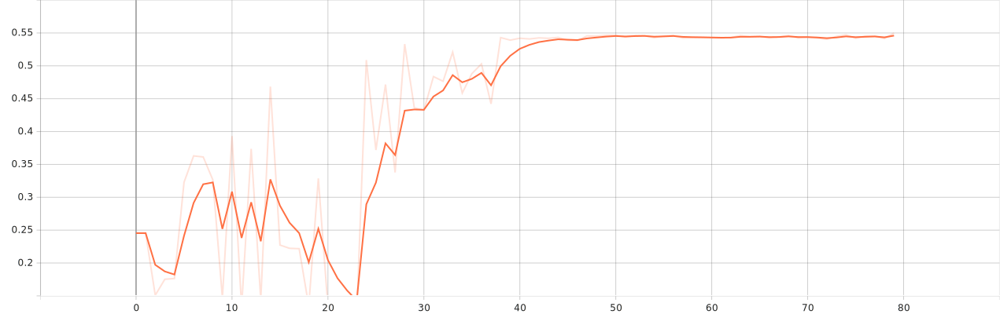
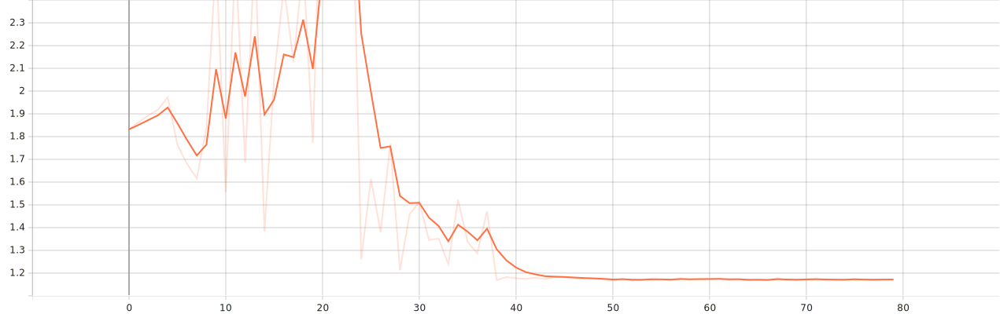

# Fer Emotion Classification

## Dataset
The dataset is [fer2013](https://paperswithcode.com/dataset/fer2013). I splitted 70/30 for validation and used filp horizontal and rotation augmentation.

 

## Model
The model that I used was combination of transformers and resnet34 backbone. Implemented using [this](https://www.sciencedirect.com/science/article/abs/pii/S0020025521008495?via%3Dihub) paper.

 

## Training 
For the training i used AdamW optimizer with 0.01 learning rate and weight decay: 0.1.

 

## Results
The result of the training was very good with fast convergence.

### Training accuracy

### Training loss

### validation accuracy

### validation loss

