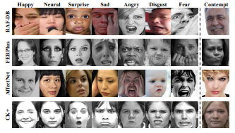
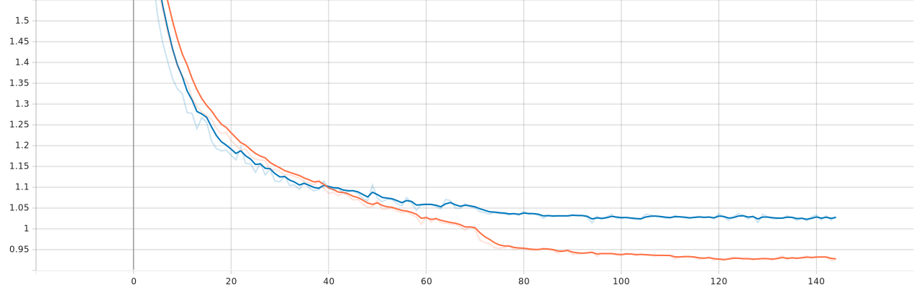

# Fer Emotion Classification

## Dataset
The dataset is [fer2013](https://paperswithcode.com/dataset/fer2013). I splitted 70/30 for validation and used filp horizontal and rotation augmentation. This dataset consists of 35887 grayscale, 48x48 sized face images with seven emotions - angry, disgusted, fearful, happy, neutral, sad and surprised.

 

## Model
The model that I used was a simple Convnet including Conv2D and Maxpooling2D and i used softmax activation at the end of the layer for 7 classes classification.

 

## Training 
For the training i used Adam optimizer with 0.001 learning rate and decay: 1e-6.

 

## Results
The result of the training was very good with fast convergence. (orange is for training and blue plot is for the validation)

### Training and validation accuracy

### Training and validation loss

